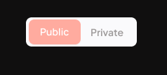

# Everdome Frontend Recruitment

## How to run the project

1.  install dependencies with `yarn install`
2.  run `yarn dev` to start the application

Access the application at `http://localhost:3000`

## Introduction

Welcome to the Everdome Frontend Recruitment task! This repository is designed to assess your skills in frontend development using a simple form component. Your challenge is to implement various functionalities in a Next.js application. 

Assume this is outside facing application targeted to general audience.

### Requirements

- [ ] Add a public/private switch to the form, with a default value of private. See the designs for reference. Please don't use any external libraries for this switch.
- [ ] When the switch is set to private, an additional password field should be displayed.
- [ ] Handle form validation according to the following rules:
  - All fields are required.
  - Name should be between 3 to 50 characters long.
  - Country select should be limited to Poland, Germany, France and Spain. In private mode, it should exclude France and Spain.
  - Duration must be a positive integer. In private mode, it cannot exceed 20 days.
  - The password must be at least 8 characters long and contain at least one uppercase letter, one lowercase letter, one number, and one special character.
- [ ] Handle error messages for all fields.
- [ ] Implement functionality for `Reset` button.
- [ ] Implement server-side code that will handle form submission. It should only validate the form again and return json object with success indicator. App is based on app router, but you can switch to pages router if you prefer.

### Evaluation

You will be evaluated based on quality of the result code, attention to detail and good practices. Feel free to make any changes to the codebase as needed to deliver a high-quality solution.

### Designs

You can find the design for switch button[here](https://www.figma.com/design/G55BF0UZqhUvuTr9KSKXC0/Untitled?m=dev).

### Delivery

- Fork this repository.
- Create your own repository from the fork.
- Implement all the requirements.
- Send us the link to your repository.