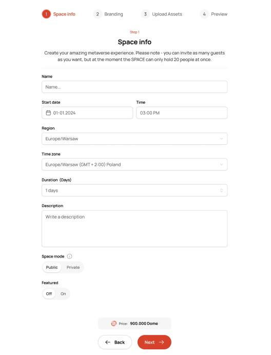
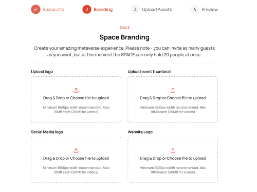

# Everdome Frontend Recruitment

## Introduction

Welcome to the Everdome Frontend Recruitment task! This repository is designed to assess your skills in frontend development using a simple form component. Your challenge is to implement various functionalities in a Next.js application. Feel free to enhance the codebase as needed to deliver a high-quality solution.

### Requirements

- [ ] Add the Open Sans font to the project in the way you find most suitable.
- [ ] Add a public/private switch to the form, with a default value of private.
- [ ] When the switch is set to private, an additional password field should be displayed.
- [ ] Handle form validation according to the following rules:
  - All fields are required.
  - The name should be between 3 to 50 characters long.
  - The start date cannot be in the past or more than 30 days in the future.
  - Time can be selected in 30-minute intervals, only after the start date is picked, and it must not be in the past.
  - Duration must be a positive integer. In private mode, it cannot exceed 20 days.
  - The password must be at least 8 characters long and contain at least one uppercase letter, one lowercase letter, one number, and one special character.
- [ ] Handle error messages for all fields.
- [ ] Add second button that will reset the form.
- [ ] Display this form as main page of the application using either app or pages router.
- [ ] Implement server-side code that will handle form submission. It should only validate the form again and return json object with success indicator.

### Designs

You can find the design for the form in the `designs` folder. Feel free to use it as a reference for your implementation.

### Delivery

- Clone this repository
- Create a branch named after your full name
- Implement the requirements
- Create merge request with your solution